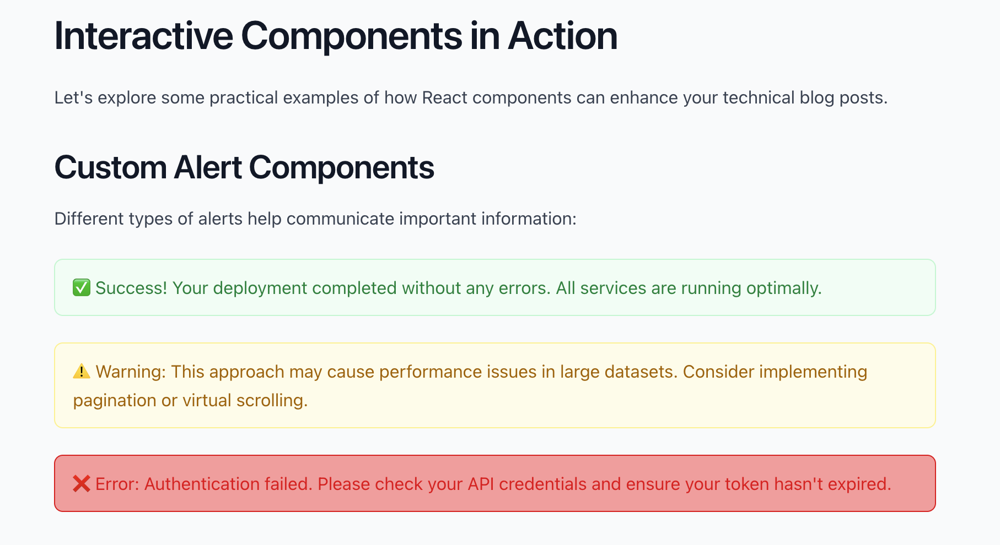
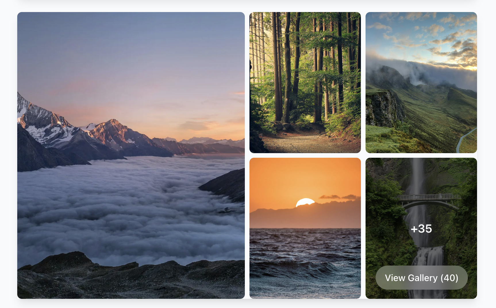
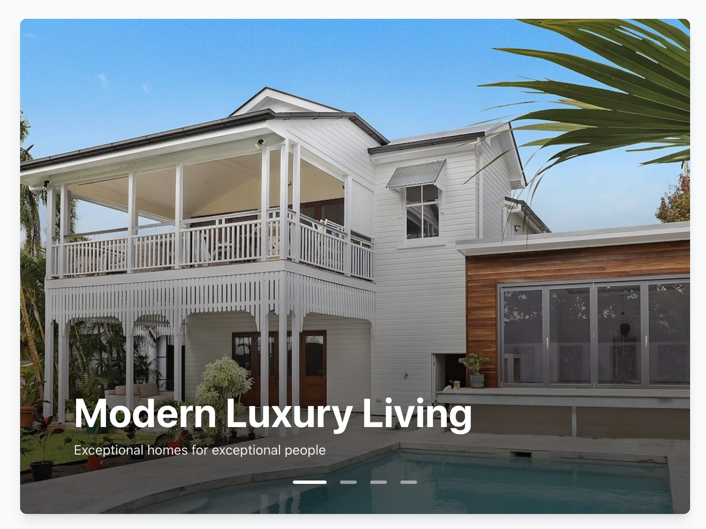

# Personal Blog - Next.js 15 with MDX

A modern, feature-rich personal blog application built with Next.js 15, perfect for software developers and content creators. This blog supports MDX (Markdown + React), has a beautiful responsive design, and includes advanced features like syntax highlighting, dynamic themes, and social integrations.


## ✨ Features

- **📝 MDX Support** - Write blog posts in Markdown with React components
- **🎨 Modern Design** - Beautiful, responsive UI with dark/light mode
- **⚡ High Performance** - Built with Next.js 15 and Turbopack
- **🔍 SEO Optimized** - Meta tags, Open Graph, and structured data
- **📱 Mobile First** - Responsive design that looks great on all devices
- **🎯 Developer Friendly** - TypeScript, Biome for linting, and modern tooling
- **🚀 Easy Deployment** - Deploy to Vercel with one click
- **📧 Contact Form** - Integrated email functionality with SendGrid/SMTP
- **🔗 Social Integration** - LinkedIn, GitHub, Twitter, and email links
- **📊 Analytics Ready** - Vercel Analytics and Speed Insights included
- **🎭 Dynamic Themes** - Multiple color themes with easy switching

## 🛠️ Tech Stack

- **Framework:** Next.js 15 with App Router
- **Styling:** Tailwind CSS 4
- **Content:** MDX with React components
- **Animations:** Framer Motion
- **Icons:** Lucide React
- **Analytics:** Vercel Analytics & Speed Insights
- **Deployment:** Vercel (recommended)
- **Code Quality:** Biome for linting and formatting

## 🚀 Quick Start

### Prerequisites

- Node.js 18+
- npm, yarn, pnpm, or bun

### Installation

1. **Clone the repository**

   ```bash
   git clone https://github.com/yourusername/personal-blog.git
   cd personal-blog
   ```

2. **Install dependencies**

   ```bash
   npm install
   # or
   yarn install
   # or
   pnpm install
   # or
   bun install
   ```

3. **Set up environment variables**

   ```bash
   cp .sample-env .env.local
   ```

4. **Configure your environment** (see [Environment Setup](#-environment-setup))

5. **Start the development server**

   ```bash
   npm run dev
   ```

6. **Open your browser**
   Visit [http://localhost:3000](http://localhost:3000) to see your blog!

## 🔧 Environment Setup

Create a `.env.local` file in your project root and configure the following variables:

### Required Variables

```env
# Contact Form (Choose one: SendGrid OR SMTP)
# Option 1: SendGrid
SENDGRID_API_KEY="your_sendgrid_api_key"
FROM_EMAIL="your@email.com"
FROM_EMAIL_NAME="Your Name"

# Option 2: SMTP (Alternative to SendGrid)
SMTP_HOST="smtp.gmail.com"
SMTP_PORT="587"
SMTP_USER="your@email.com"
SMTP_PASS="your_app_password"

# Email Configuration
TO_EMAIL="recipient@email.com"  # Where contact form emails are sent
NEXT_PUBLIC_EMAIL="your@email.com"  # Your public email address
```

### Social Links (Optional)

```env
# Social Media URLs
NEXT_PUBLIC_LINKEDIN_URL="https://www.linkedin.com/in/yourprofile"
NEXT_PUBLIC_GITHUB_URL="https://github.com/yourusername"
NEXT_PUBLIC_TWITTER_URL="https://twitter.com/yourusername"

# Private versions (for server-side use)
LINKEDIN_URL="https://www.linkedin.com/in/yourprofile"
GITHUB_URL="https://github.com/yourusername"
TWITTER_URL="https://twitter.com/yourusername"
```

### Setting up SendGrid (Recommended)

1. Create a [SendGrid account](https://sendgrid.com/)
2. Generate an API key in your SendGrid dashboard
3. Add your API key to `.env.local`
4. Verify your sender email address in SendGrid

### Setting up SMTP (Alternative)

For Gmail SMTP:

1. Enable 2-factor authentication on your Google account
2. Generate an App Password (not your regular password)
3. Use the App Password as your `SMTP_PASS`

## 📝 Writing Blog Posts

### Creating a New Post

1. Create a new `.mdx` file in the `/content` directory
2. Use kebab-case for filenames: `my-awesome-post.mdx`
3. Add frontmatter at the top of your file

### Frontmatter Structure

```yaml
---
title: "Your Blog Post Title"
date: "2024-01-20"
excerpt: "A brief description of your post that appears in listings"
tags: ["Next.js", "React", "TypeScript", "Web Development"]
author: "Your Name"
authorImage: "/images/authors/your-photo.jpg"
featured: true # Shows on homepage (optional)
readingTime: "5 min read" # Estimated reading time
heroImage: "/images/blog/your-hero-image.jpg" # Optional hero image
---
```

### Available React Components in MDX

Your blog supports custom React components within Markdown. Here are the available components and how to use them:

#### Alert Component

Display informational, warning, or error messages with markdown support:



```mdx
<Alert type="info" title="Information" description="This is helpful info">
  You can also include **markdown** content here!
</Alert>

<Alert type="warning" title="Warning" description="Be careful with this">
  Warning content with *emphasis*.
</Alert>

<Alert type="error" title="Error" description="Something went wrong">
  Error details here.
</Alert>

<Alert type="success" title="Success" description="Task completed">
  Success message content.
</Alert>
```

#### YouTube Component

Embed YouTube videos with responsive design:

```mdx
<YouTube id="dQw4w9WgXcQ" title="Rick Astley - Never Gonna Give You Up" />
```

#### ImageGrid Component

Display multiple images in an interactive grid with gallery modal:



```mdx
<ImageGrid
  images={[
    {
      id: "1",
      src: "/images/blog/image1.jpg",
      alt: "Description of image 1",
      width: 800,
      height: 600,
      category: "Photography",
    },
    {
      id: "2",
      src: "/images/blog/image2.jpg",
      alt: "Description of image 2",
      width: 800,
      height: 600,
      category: "Design",
    },
    {
      id: "3",
      src: "/images/blog/image3.jpg",
      alt: "Description of image 3",
      width: 800,
      height: 600,
    },
  ]}
  showCategoryBadges={true}
  showImageOverlay={true}
  galleryPatternLayout="masonry"
  masonryColumns={3}
/>
```

**ImageGrid Props:**

- `images` (required): Array of image objects with `id`, `src`, `alt`, `width`, `height`, and optional `category`
- `showCategoryBadges`: Display category labels on images (default: false)
- `showImageOverlay`: Show overlay information on hover (default: false)
- `galleryPatternLayout`: Layout type - "masonry", "pattern", or "single" (default: "masonry")
- `masonryColumns`: Number of columns in masonry layout (default: 4)

#### Card Component

Create styled content cards:

```mdx
<Card
  title="Card Title"
  description="Card description"
  footer="Optional footer"
>
  Card content goes here with **markdown** support. - List items work - Multiple
  paragraphs supported
</Card>
```

#### Button Component

Add interactive buttons with optional links:

```mdx
<Button href="/blog">Go to Blog</Button>

<Button>Click Me</Button>
```

#### Grid Component

Create responsive grid layouts for content:

```mdx
<Grid cols="3" gap="4">
  <Card title="Item 1">Content 1</Card>
  <Card title="Item 2">Content 2</Card>
  <Card title="Item 3">Content 3</Card>
</Grid>
```

**Grid Props:**

- `cols`: Number of columns - "1", "2", "3", "4", "5", or "6" (default: "2")
- `gap`: Gap size - "1", "2", "3", "4", "5", "6", or "8" (default: "4")

````

#### ChartAreaGradient Component

Display gradient area charts for data visualization:


```mdx
<ChartAreaGradient />
````

#### HeroCarousel Component

_Note: Props may be updated - check component for current usage_



```mdx
<HeroCarousel />
```

### Adding Custom Components

To add new components for use in MDX files:

1. Create your component in `/app/components/`
2. Import it in `/app/components/blog/mdx.tsx`
3. Add it to the `components` object
4. Use it in your MDX files

Example:

```typescript
// In mdx.tsx
import { MyCustomComponent } from "../MyCustomComponent";

let components = {
  // ... other components
  MyCustomComponent,
};
```

Then use in MDX:

```mdx
<MyCustomComponent prop1="value1" prop2="value2" />
```

### Markdown Features

- **Syntax Highlighting** - Code blocks with language-specific highlighting
- **GitHub Flavored Markdown** - Tables, task lists, and more
- **Automatic Slugs** - Headings get automatic anchor links
- **Typography** - Beautiful typography with Tailwind Typography plugin

### Example Blog Post

````mdx
---
title: "Getting Started with Next.js 15"
date: "2024-01-20"
excerpt: "Learn how to build modern web applications with Next.js 15"
tags: ["Next.js", "React", "Web Development"]
author: "Your Name"
authorImage: "/images/authors/your-photo.jpg"
featured: true
readingTime: "8 min read"
---

## Introduction

Welcome to Next.js 15! This guide will help you get started.

<Alert type="info">
  Next.js 15 introduces many exciting features including improved performance
  and developer experience.
</Alert>

## Code Example

```typescript
// Example TypeScript code
interface User {
  name: string;
  email: string;
}

const user: User = {
  name: "John Doe",
  email: "john@example.com",
};
```
````

## Conclusion

Next.js 15 is amazing for building modern web applications!

````

## 🎨 Customization

### Changing Themes

The blog includes multiple color themes. Switch themes using npm scripts:

```bash
# Available themes: green, blue, purple, orange
npm run theme:blue
npm run theme:green
npm run theme:purple
npm run theme:orange
````

### Customizing Components

- **Header/Navigation:** Edit `/app/components/navbar/Navbar.tsx`
- **Footer:** Edit `/app/components/layout/Footer.tsx`
- **Hero Section:** Edit `/app/components/sections/Hero.tsx`
- **MDX Components:** Edit `/app/components/blog/mdx.tsx`

### Adding Your Information

1. Update personal information in `/app/components/sections/Hero.tsx`
2. Replace author image in `/public/images/authors/`
3. Update social links in environment variables
4. Modify the footer contact information

## 📁 Project Structure

```
personal-blog/
├── app/                    # Next.js app directory
│   ├── blog/              # Blog pages and layouts
│   ├── components/        # React components
│   │   ├── layout/        # Layout components
│   │   ├── navbar/        # Navigation components
│   │   ├── sections/      # Page sections
│   │   └── ui/            # UI components
│   ├── globals.css        # Global styles
│   └── layout.tsx         # Root layout
├── content/               # Blog posts (MDX files)
├── public/                # Static assets
│   └── images/            # Images for blog and authors
├── scripts/               # Build and utility scripts
├── .sample-env            # Environment variables template
├── biome.json             # Biome configuration
├── next.config.ts         # Next.js configuration
├── tailwind.config.ts     # Tailwind CSS configuration
└── mdx-components.tsx     # Next.js MDX configuration (legacy)
```

## 🚀 Deployment

### Deploy to Vercel (Recommended)

1. Push your code to GitHub
2. Connect your repository to [Vercel](https://vercel.com)
3. Add your environment variables in Vercel's dashboard
4. Deploy! ✨

[](https://vercel.com/new/clone?repository-url=https://github.com/yourusername/personal-blog)

### Deploy to Netlify

1. Build your project: `npm run build`
2. Deploy the `out` directory to Netlify
3. Add environment variables in Netlify's dashboard

### Deploy to Railway

1. Connect your GitHub repository
2. Add environment variables
3. Deploy with one click

## 🔧 Available Scripts

```bash
# Development
npm run dev          # Start development server with Turbopack
npm run build        # Build for production
npm run start        # Start production server

# Code Quality
npm run lint         # Run Biome linter
npm run format       # Format code with Biome

# Theme Switching
npm run theme:green  # Switch to green theme
npm run theme:blue   # Switch to blue theme
npm run theme:purple # Switch to purple theme
npm run theme:orange # Switch to orange theme
```

## 🤝 Contributing

1. Fork the repository
2. Create a feature branch: `git checkout -b feature/amazing-feature`
3. Commit your changes: `git commit -m 'Add amazing feature'`
4. Push to the branch: `git push origin feature/amazing-feature`
5. Open a Pull Request

## 📄 License

This project is open source and available under the [MIT License](LICENSE).

## 🆘 Support

If you have any questions or need help:

1. Check the [documentation](https://nextjs.org/docs)
2. Create an [issue](https://github.com/yourusername/personal-blog/issues)
3. Contact me via [email](mailto:your@email.com)

## 🙏 Acknowledgments

- [Next.js](https://nextjs.org/) - The React framework for production
- [Tailwind CSS](https://tailwindcss.com/) - Utility-first CSS framework
- [MDX](https://mdxjs.com/) - Markdown for the component era
- [Framer Motion](https://www.framer.com/motion/) - Motion library for React
- [Vercel](https://vercel.com/) - Platform for deploying Next.js applications

---

**Happy blogging! 🎉**

Made with ❤️ by [John Doe](https://github.com/asdutoit)
